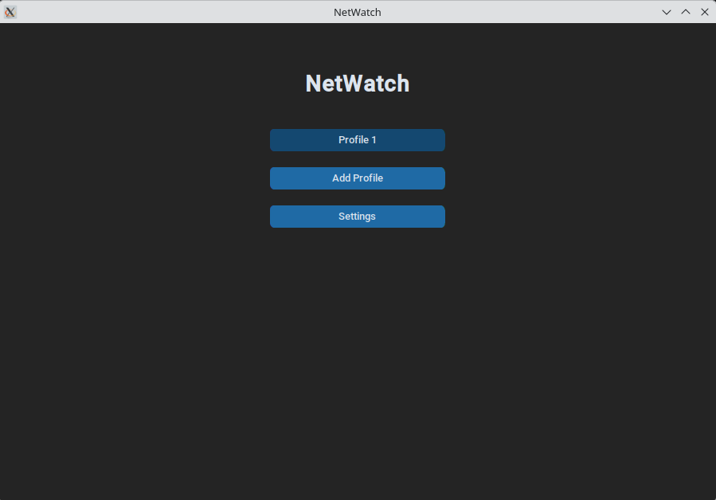
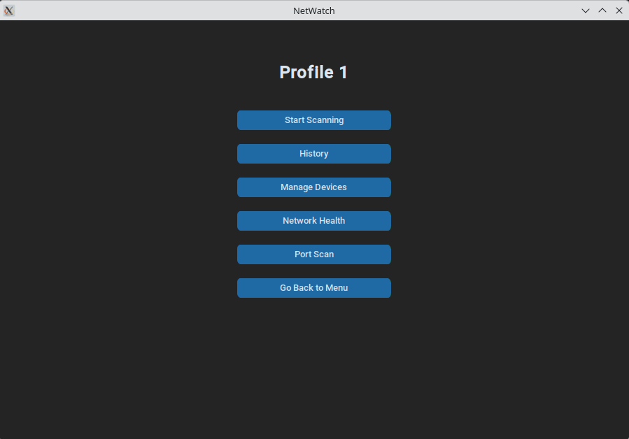

# NetWatch

A desktop network-monitoring tool that discovers every device on your local
network, tracks how that picture changes over time, and flags what's new.

Built with Python and CustomTkinter for CSP1123 Mini IT Project.

## Download (Windows)

**[⬇ Download the latest NetWatch.exe](https://github.com/Sardorbek-000/NetWatch/releases/latest)**

A single self-contained executable — no Python installation required. Three
things to know before the first run:

1. **Install [Npcap](https://npcap.com/#download)** (free, ~1 MB). NetWatch
   discovers devices by sending raw ARP packets, which Windows provides no
   built-in way to do; Npcap supplies that capability. Device scanning will not
   work without it. It cannot be bundled inside `NetWatch.exe` for licensing
   reasons. *(Port scanning uses ordinary sockets and works without Npcap.)*
2. **Approve the administrator prompt.** Raw ARP packets require administrator
   rights, so the app requests elevation on launch.
3. **Windows SmartScreen may warn that the publisher is unknown.** This is
   expected for any unsigned executable — code-signing certificates are a paid
   commercial product. Choose *More info → Run anyway*.

Your profiles and scan history are stored in `netwatch.db`, created in the
folder you run `NetWatch.exe` from. Keep the `.exe` somewhere writable — your
Desktop or a folder in your user directory is fine; `C:\Program Files` is not,
because standard users cannot write there. Moving the `.exe` without its
`netwatch.db` starts you with an empty history, and deleting `netwatch.db`
resets the app.

Linux and macOS users run from source — see [Installation](#installation).

## Features

- **Location Profiles** — separate scan histories per network ("Home",
  "University"), so devices seen on campus don't mix with devices seen at
  home. Profiles are created, listed and deleted from the app.
- **Wireless and wired scanning** — ARP-based discovery of every device
  answering on the subnet, reporting IP address, MAC address, hardware
  vendor and hostname. Runs once on demand or repeatedly on a chosen
  interval.
- **Vendor identification** — MAC addresses are resolved to manufacturer
  names from a locally cached IEEE vendor database.
- **Hostname resolution** — reverse DNS lookups performed with a
  hand-built PTR query, so no external resolver library is required.
- **Scan history** — every scan is stored and browsable, with a per-scan
  detail view listing all devices found.
- **Scan comparison** — compare any two scans side by side to see which
  devices joined the network and which disappeared.
- **Network health score** — each scan is scored 0–100 based on new,
  missing and unknown-vendor devices, shown with a trend chart over a
  selectable date range.
- **Device naming** — assign friendly names to devices per profile, keyed
  by MAC address, so "unknown device" becomes "Ethan's laptop".
- **Port scanning** — scan any host for open TCP ports, either a curated
  set of 82 common ports or the full 1–65535 range, with live progress and
  a stop control.
- **Desktop notifications** on scan start and completion.

## Requirements

- Python 3.10 or newer (developed on 3.14)
- Administrator / root privileges for network scanning

ARP scanning builds and sends raw Ethernet frames rather than using ordinary
TCP/UDP sockets, and operating systems restrict raw-socket access to
privileged users. Without them, the scanner raises
`InsufficientPrivilegesError`. Port scanning uses normal sockets and needs no
special privileges.

## Installation

```bash
git clone https://github.com/Sardorbek-000/NetWatch.git
cd NetWatch
python -m venv .venv
source .venv/bin/activate        # Windows: .venv\Scripts\activate
pip install -r requirements.txt
```

## Running

From the **repository root**:

```bash
python -m UI.app
```

> Run it as a module from the root, not as `python UI/app.py`. Running the
> file directly makes Python treat `UI/` as the top-level directory, so the
> `from core...` and `from database...` imports fail. The database file
> `netwatch.db` is also created relative to the working directory, so running
> from the root keeps everyone on the same database.

On Linux and macOS, network scanning needs elevated privileges:

```bash
sudo .venv/bin/python -m UI.app
```

## Project structure

```
core/                  Network scanning engines
  wireless_scanner.py    ARP discovery (wireless + wired), MAC vendor
                         lookup, DNS PTR hostname resolution
  ParsePorts.py          Threaded TCP port scanner
  validators.py          Shared IP / MAC / CIDR validation

database/              Persistence and analytics
  storage.py             SQLite access layer: profiles, scans, devices,
                         health scores, scan comparison
  schema.sql             Reference copy of the schema

UI/                    CustomTkinter desktop app
  app.py                 Application shell and page navigation
  pages/                 One file per screen
  notifier.py            Desktop notifications
  theme.py               Shared colour constants

tests/                 Test suite

NetWatch.spec          PyInstaller build recipe
.github/workflows/     CI: builds and publishes the Windows release
```

## Running the tests

```bash
python -m pytest tests/
```

## Screenshots

**Main menu** — every saved Location Profile appears as a button, alongside
the Add Profile and Settings entry points.



**Profile hub** — once inside a profile, each feature is one click away:
scanning, history, device management, network health and port scanning.



## Building the release

Releases are built automatically. Pushing a version tag runs
[`.github/workflows/release.yml`](.github/workflows/release.yml) on a Windows
runner, which installs the pinned dependencies, runs the test suite, builds the
binary with PyInstaller and attaches it to a new GitHub Release:

```bash
git tag v1.0.0
git push origin v1.0.0
```

To produce a build without publishing one, use **Run workflow** on the Actions
tab — that uploads `NetWatch.exe` as a downloadable workflow artifact and
creates no Release.

PyInstaller cannot cross-compile, so a Windows `.exe` can only be produced on
Windows. On a Windows machine with the dependencies installed, the same build
runs locally:

```bash
pip install pyinstaller==6.22.3
pyinstaller --noconfirm --clean NetWatch.spec   # -> dist/NetWatch.exe
```

[`NetWatch.spec`](NetWatch.spec) documents why each bundled dependency,
hidden import and exclusion is there. Packaging is confined to that file and
the workflow — no application source file is modified or added for the
release, so the binary runs exactly the code in this repository.

## Team

| Member | Responsibility |
| --- | --- |
| Amin (Muhammadamin) | Application shell and page navigation, port scanner, desktop notifications |
| Ethan | Database and storage layer, analytics, network health scoring |
| Sardorbek | Network scanning engine, scan and history screens |

---

<sub>

**Future improvements**

The port scanner reports open ports only. A firewall that silently drops
probes is indistinguishable from a slow network at the socket level, so
scanning a stealthy host returns an empty list; separating `filtered` from
`closed` is inherent to TCP-connect scanning rather than a quick fix. Related,
full-range scans are slow by design — `max_threads` defaults to 3 because
testing against a real LAN host showed that 4 or more concurrent connections
cause false negatives, as an open port's handshake gets delayed past the
timeout under contention. Correctness was chosen over speed here: a fast scan
that misses open ports is worse than a slow one. Beyond the scanner, CSV
export of scan history and port results is not yet implemented, and
notifications currently fire on port scans but not when a network scan finds a
new or disconnected device, although `Storage.compare_scans()` already
computes that difference.

</sub>

<sub>Developed for CSP1123 Mini IT Project, Trimester 2620.</sub>
